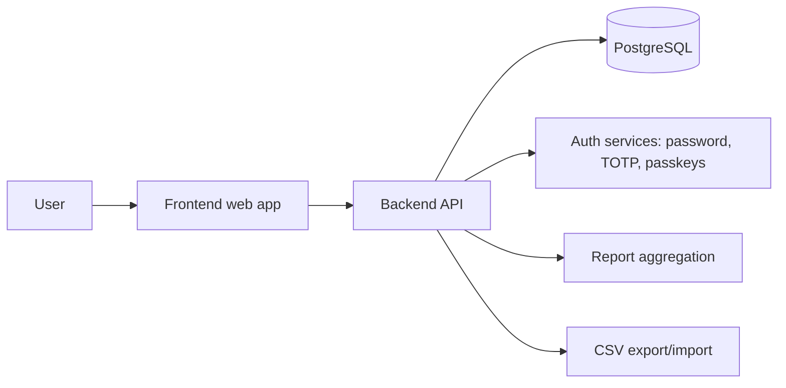

# Agentic AI Workflow for emiTMachine

This document describes how to use repository agents to implement emiTMachine from `todo.txt`.

## Agent map

| Agent | Primary responsibility | Main files |
| --- | --- | --- |
| `ui/ux designer` | Product flow, mobile-first screens, UI states, English labels | `todo.txt`, `frontend/src/**`, `doc/**` |
| `postgres db expert` | PostgreSQL schema, init SQL, constraints, indexes | database SQL files, `doc/**` |
| `security/auth specialist` | Password auth, TOTP, passkeys, recovery codes, session security | backend auth code, schema, `doc/**` |
| `backend developer` | API endpoints, services, business rules, reports, CSV import/export | `backend/**` |
| `frontend developer` | Responsive UI, forms, charts, API integration | `frontend/**` |
| `devops` | Dockerfiles, Compose, local environment, runtime docs | `Dockerfile`, `docker-compose.yml`, `README.md` |
| `qa/test engineer` | Automated tests, manual test matrix, regression checks | test files, `doc/**` |
| `technical writer` | README, architecture docs, Mermaid diagrams | `README.md`, `doc/**` |

## Recommended sequence

1. Ask `ui/ux designer` to convert `todo.txt` into the page flow and UI states.
2. Ask `postgres db expert` to design and implement the PostgreSQL schema/init SQL.
3. Ask `security/auth specialist` to define the authentication and recovery model.
4. Ask `backend developer` to implement APIs in small slices.
5. Ask `frontend developer` to implement screens and API integration.
6. Ask `devops` to wire Docker Compose and local setup.
7. Ask `qa/test engineer` to verify behavior and fill test gaps.
8. Ask `technical writer` to finalize README and technical diagrams.

## Implementation prompts

### 1. Product and UI flow

```text
@ui/ux designer: Read todo.txt and produce the complete mobile-first page flow for emiTMachine. Include login, registration, TOTP setup, passkey login, password recovery, dashboard, punch confirmation, tag management, CSV import/export, and profile settings. Keep all UI text in English.
```

Expected output:
- Page list
- Navigation map
- Mobile and desktop behavior
- Exact labels for buttons and forms
- Empty/loading/error/success states

### 2. Database foundation

```text
@postgres db expert: Read todo.txt and design the complete PostgreSQL schema for a multi-user time tracker. Include users, sessions, time events, tags, tag assignments, passkeys, TOTP secrets, recovery codes, audit logs, and CSV import tracking. Explain constraints and indexes before implementing SQL.
```

Expected output:
- Table model
- Relationship notes
- Security notes
- Init SQL file
- Index and constraint rationale

### 3. Authentication model

```text
@security/auth specialist: Read todo.txt and define the complete auth architecture for password login, TOTP QR setup and verification, passkey registration/login, password change, recovery code generation, and account recovery. Include storage rules, cookie/session settings, rate limits, and audit events.
```

Expected output:
- Sequence of each auth flow
- Server-side verification rules
- Secret storage requirements
- Recovery code lifecycle
- Security review checklist

### 4. Backend API

```text
@backend developer: Read todo.txt and list the required REST API endpoints with HTTP methods, payloads, responses, authorization requirements, and error cases for auth, profile, punch in/out, tags, reports, and CSV import/export.
```

Then implement in slices:

```text
@backend developer: Implement registration, password login, logout, current-user profile, and authenticated session handling. Use PostgreSQL only through the data access layer and do not initialize schema from backend code. Add focused tests.
```

```text
@backend developer: Implement punch in/out APIs. Enforce one active session per user, validate editable client time, attach tags, and return updated daily, weekly, and monthly aggregates.
```

```text
@backend developer: Implement CSV export and restore import. Export all punch events with tag data. Import must append restored historical entries without deleting existing records.
```

### 5. Frontend screens

```text
@frontend developer: Read todo.txt and implement the responsive dashboard. Show daily, weekly, and monthly charts at the top, the correct Clock in/Clock out button state, tag selection, and an editable client-time confirmation dialog.
```

```text
@frontend developer: Implement profile settings for change password, TOTP QR setup, passkey registration, recovery code download, CSV export, and CSV restore import. Keep every label in English.
```

Expected output:
- Responsive pages
- API integration
- Loading/error/empty states
- Accessible forms and confirmation dialogs

### 6. Docker and local runtime

```text
@devops: Read todo.txt and implement Docker Compose for frontend, backend, and PostgreSQL. Add persistent database storage, environment variable examples, service dependencies, and README run instructions. Keep the setup ready for a manual HTTPS reverse proxy.
```

Expected output:
- Working Compose stack
- Clear ports and environment variables
- Persistent PostgreSQL volume
- Local setup documentation

### 7. Testing

```text
@qa/test engineer: Read todo.txt and create a test matrix for registration, login, TOTP, passkeys, recovery codes, punch in/out, tag colors, chart aggregation, CSV export/import, and Docker startup.
```

```text
@qa/test engineer: Add automated tests for punch rules, one active session per user, chart aggregation, tag assignment, CSV restore import, and authorization failures.
```

### 8. Documentation

```text
@technical writer: Read todo.txt and update README.md plus doc/ with English documentation. Include setup instructions, architecture overview, API overview, security notes, and Mermaid diagrams for auth, passkeys, punch in/out, CSV restore, and container architecture.
```

## Mermaid overview



## Practical rules

- Start each task by referencing `todo.txt`.
- Ask for a plan before large implementation work.
- Implement in small slices and test each slice.
- Keep docs updated as behavior changes.
- Keep user-facing language in English, even when prompts are written in Italian.
