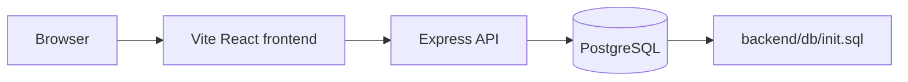
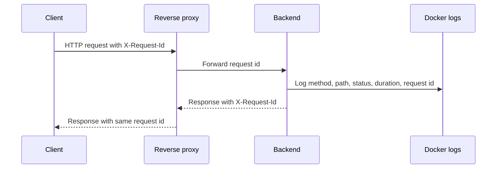
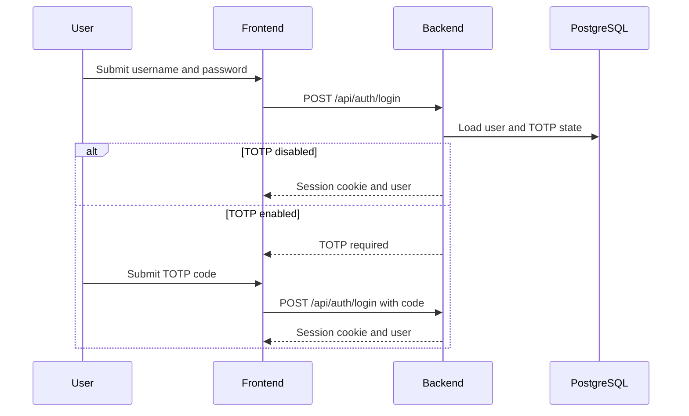
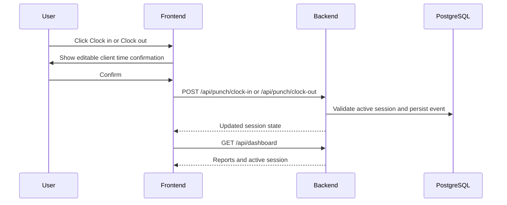
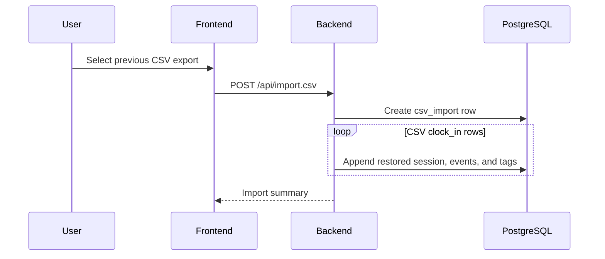

# emiTMachine Architecture

## Container View

## Logging

The Docker Compose stack writes service logs to stdout and stderr so Docker, a reverse proxy, or a host logging driver can collect them without extra files or sidecars.

Backend logging is configured through environment variables on the `backend` service:

- `LOG_LEVEL`: minimum emitted severity. Recommended values are `debug`, `info`, `warn`, and `error`.
- `LOG_FORMAT`: emitted log shape. Use `pretty` for local development and `json` for structured collection.

Every backend request should have a request id. If an upstream proxy or client sends `X-Request-Id`, the backend should keep that value and include it in request logs and the response header. If no request id is supplied, the backend should generate one and return it as `X-Request-Id`. This makes a single request traceable across browser developer tools, proxy access logs, backend logs, and error reports.

## Login With TOTP

## Punch In And Out

## CSV Restore

