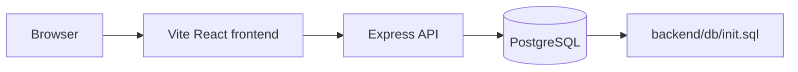
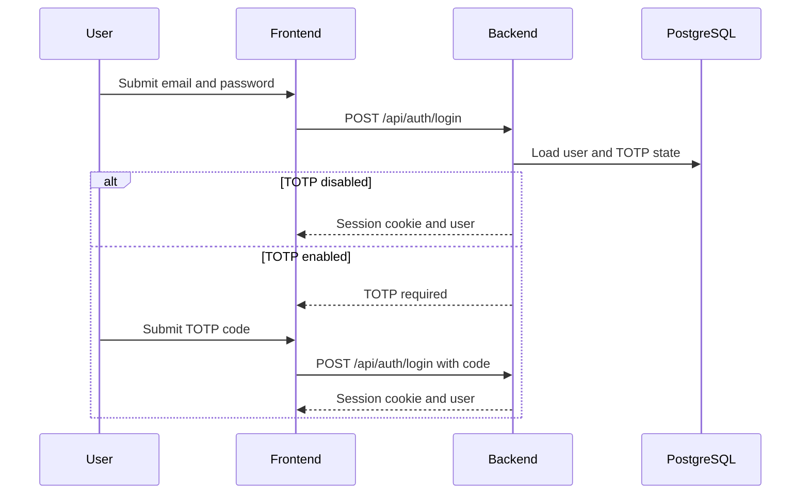
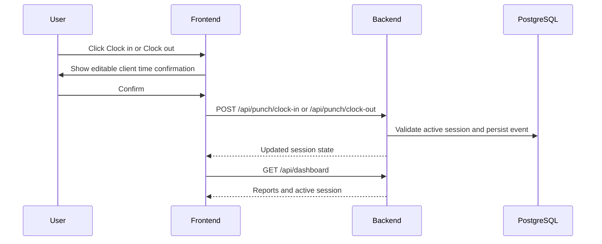
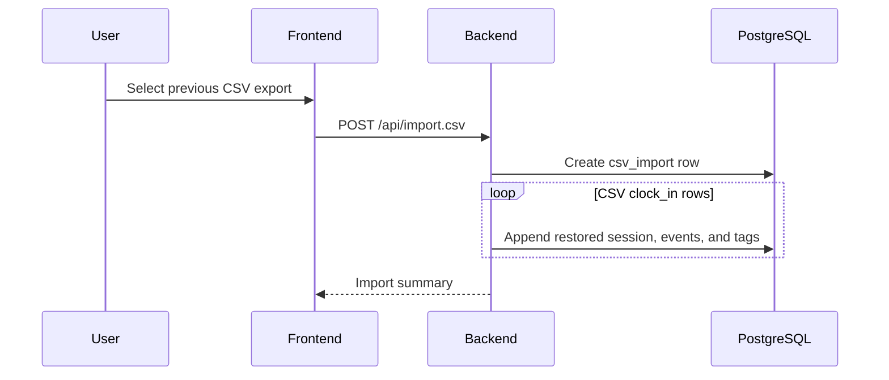

# emiTMachine Architecture

## Container View

```mermaid
flowchart LR
    Browser[Browser] --> Frontend[Vite React frontend]
    Frontend --> Backend[Express API]
    Backend --> Postgres[(PostgreSQL)]
    Postgres --> Init[backend/db/init.sql]
```

## Login With TOTP

```mermaid
sequenceDiagram
    participant U as User
    participant F as Frontend
    participant B as Backend
    participant D as PostgreSQL
    U->>F: Submit email and password
    F->>B: POST /api/auth/login
    B->>D: Load user and TOTP state
    alt TOTP disabled
        B-->>F: Session cookie and user
    else TOTP enabled
        B-->>F: TOTP required
        U->>F: Submit TOTP code
        F->>B: POST /api/auth/login with code
        B-->>F: Session cookie and user
    end
```

## Punch In And Out

```mermaid
sequenceDiagram
    participant U as User
    participant F as Frontend
    participant B as Backend
    participant D as PostgreSQL
    U->>F: Click Clock in or Clock out
    F->>U: Show editable client time confirmation
    U->>F: Confirm
    F->>B: POST /api/punch/clock-in or /api/punch/clock-out
    B->>D: Validate active session and persist event
    B-->>F: Updated session state
    F->>B: GET /api/dashboard
    B-->>F: Reports and active session
```

## CSV Restore

```mermaid
sequenceDiagram
    participant U as User
    participant F as Frontend
    participant B as Backend
    participant D as PostgreSQL
    U->>F: Select previous CSV export
    F->>B: POST /api/import.csv
    B->>D: Create csv_import row
    loop CSV clock_in rows
        B->>D: Append restored session, events, and tags
    end
    B-->>F: Import summary
```
