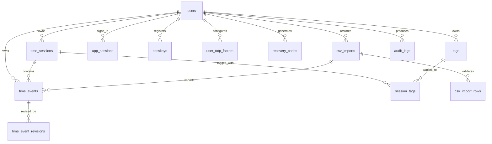

# Database and Security Schema

`backend/db/init.sql` is the PostgreSQL source of truth for emiTMachine database infrastructure. The backend must query this schema and must not create tables, indexes, triggers, or extensions at runtime.

## Core Model

- `users` stores multi-user accounts with role, status, timezone, name/email profile fields, password hash metadata, and a mutable `public_id`. The internal `id` remains the relational primary key; `public_id` is the admin-editable user-facing identifier generated as a UUID by default.
- `user_managers` links users to one or more responsible admin users. The responsible user must be validated by backend policy as an approved admin.
- `time_sessions` stores clocked work intervals. It enforces one open session per user and rejects overlapping sessions for the same user.
- `time_events` stores clock-in, clock-out, break, and manual-adjustment events. Every event stores the client-submitted timestamp and explicit client timezone.
- `tags` stores user-owned default and custom tags. Only `Presence` is marked as the default tag. `default_tag_templates` seeds `Presence`, `Smart working`, and `Not billable` with colors for registration-time tag creation; all tag colors are constrained to six-digit hex values.
- `session_tags` links sessions to tags. A trigger requires every tag to be owned by the same user as the time session.
- `csv_imports` and `csv_import_rows` track restore uploads, validation results, and imported rows. Imported time events are appended and linked back to their import metadata.
- `countdowns` stores user countdowns, optionally linked to the current work session.

## Authentication Tables

- `app_sessions` stores hashed browser session tokens, optional hashed CSRF tokens, expiry, and revocation state.
- `user_totp_factors` stores encrypted TOTP secrets, not raw secrets. `secret_ciphertext`, `secret_nonce`, and `secret_key_id` are intended for application-managed envelope encryption. The `users.totp_secret` column remains as a compatibility field for the current backend and should be migrated away from raw Base32 storage.
- `passkeys` stores WebAuthn credential IDs and public keys. Credential IDs are unique, and sign counters are non-negative.
- `passkey_challenges` stores hashed passkey challenges with expiry and one-time consumption metadata. `webauthn_challenges` is included for future WebAuthn metadata.
- `recovery_codes` stores one-time recovery code hashes only. Raw recovery codes must only be shown to the user at generation time.
- `auth_rate_limits` stores per-action rate-limit counters by hashed identifier and optional IP address.
- `audit_logs` stores security and account events without secrets, tokens, TOTP values, recovery codes, or passkey private material.

## Integrity Decisions

- Multi-user isolation is modeled with `user_id` foreign keys on user-owned rows and ownership triggers where simple foreign keys are not expressive enough.
- `one_active_session_per_user` prevents more than one open time session per user.
- `time_sessions_no_overlap` uses a GiST exclusion constraint to prevent overlapping sessions for the same user.
- Timestamp fields that represent user-confirmed actions use `timestamptz`, and client timezone text is stored separately for display and audit.
- Manual edits require a reason, and `time_event_revisions` keeps before/after values for event corrections.
- CSV restore imports append rows; no import table supports deleting or replacing existing history.
- Database defaults and constraints cover structural rules. Backend code still must validate password hashes, TOTP codes, passkey assertions, challenge freshness, session cookie flags, CSRF checks, and user-facing authorization.

## Operational Notes

- Required PostgreSQL extensions: `pgcrypto`, `citext`, and `btree_gist`.
- Password hashes should be produced by a modern password hashing algorithm such as Argon2id before insertion.
- Session tokens, CSRF tokens, auth challenges, recovery codes, and rate-limit identifiers should be generated with high entropy and stored only as hashes.
- Audit metadata must be sanitized before insert. Do not store secrets, raw credentials, one-time codes, or full session tokens.

## Relationship Overview

