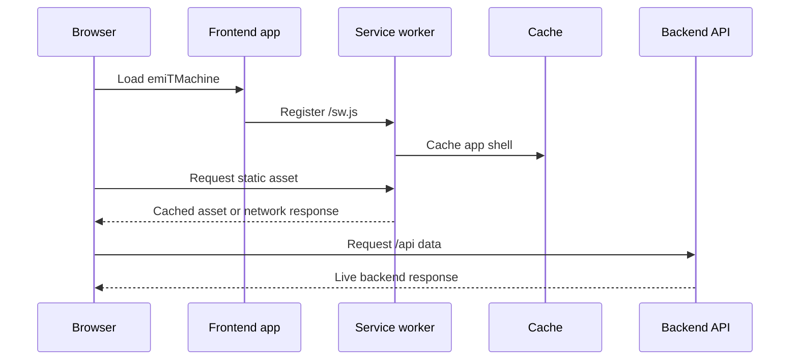

# Progressive Web App

emiTMachine includes Progressive Web App support through static frontend assets:

- `frontend/public/manifest.webmanifest` declares the app name, install behavior, colors, shortcuts, and icon paths.
- `frontend/public/sw.js` registers a service worker that caches the application shell and static frontend assets.
- `frontend/public/icons/icon-placeholder.svg` and `frontend/public/icons/icon-maskable-placeholder.svg` are temporary icon placeholders.
- `frontend/src/pwa.ts` registers the service worker from the React entry point.

## Installation

Run emiTMachine from an HTTPS origin in production. Browsers also allow PWA testing from `localhost`.

1. Start the application.
2. Open the frontend URL in a browser.
3. Use the browser install action:
   - Chrome and Edge show an install icon in the address bar or an `Install app` menu action.
   - Safari on iOS uses `Share` and then `Add to Home Screen`.
4. Launch emiTMachine from the installed app icon.

The installed app opens at `/` in standalone mode.

## Offline Behavior

The service worker caches the frontend shell and same-origin static assets. This lets the app shell load again when the network is unavailable after the first successful visit.

API calls under `/api` are intentionally not cached. Time tracking, authentication, reports, CSV import/export, and administrative workflows still require the backend and PostgreSQL to be reachable. This avoids showing stale or misleading business data.

## Notifications

Countdown expiry and live activity reminder notifications are available inside the installed PWA and regular supported browsers.

1. Open the web app and sign in.
2. Accept the browser notification permission prompt when it appears.
3. Create a countdown.
4. Keep the PWA open or recently active so the frontend can watch the countdown.
5. When the target time is reached, the service worker shows a `Countdown expired` notification.

Live activity reminders are configured during clock-in. Enter the number of hours and minutes after the confirmed event time when the notification should be shown. For example, a clock-in event at `08:00` with `7h 55m` notifies at `15:55`.

Tapping the notification focuses emiTMachine and opens the Countdowns view when the browser supports service worker notification click handling.

These are local browser notifications. They are not server push notifications, so the backend does not store push subscriptions and the app does not send alerts after the browser has fully stopped the PWA.

If notifications are blocked, re-enable them from the browser site settings or from the Android app notification settings for the installed PWA.

## Icon Placeholders

The committed icons are placeholders so the PWA can be wired before final artwork exists.

Replace these files before a production release:

- `frontend/public/icons/icon-placeholder.svg`
- `frontend/public/icons/icon-maskable-placeholder.svg`

Keep the manifest paths stable unless you also update `frontend/public/manifest.webmanifest` and `frontend/index.html`.

Recommended final assets:

- A regular app icon with at least `192x192` and `512x512` PNG variants, or a production-ready SVG.
- A maskable icon with a safe zone so Android launchers can crop it cleanly.
- An Apple touch icon PNG for best iOS compatibility.

If PNG assets are added, update the `icons` array in `manifest.webmanifest` with their exact `src`, `sizes`, `type`, and `purpose` values.

## Update Flow

The service worker uses a versioned cache name. When static PWA assets change, update `CACHE_NAME` in `frontend/public/sw.js` so browsers remove the previous cache during activation.

Users may need to close all installed app windows before the browser activates the newest service worker.

